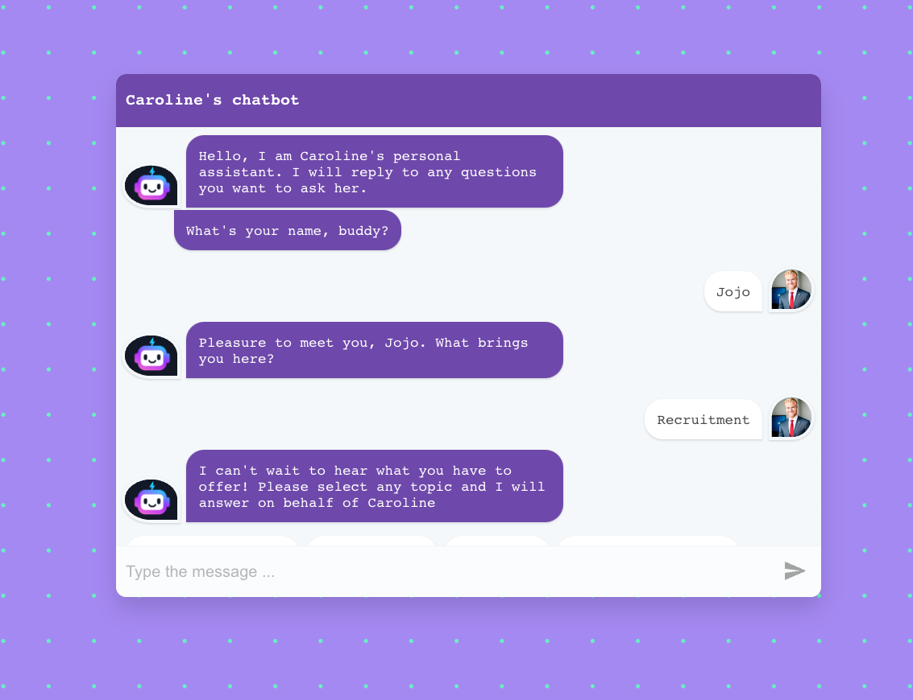
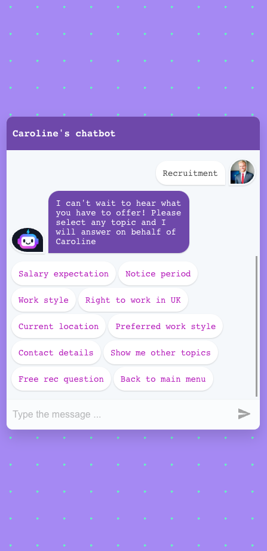
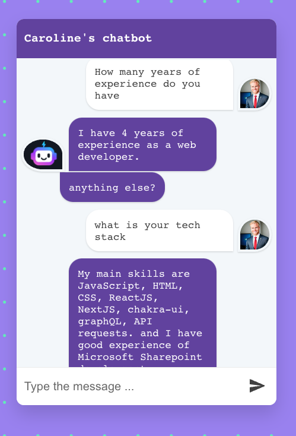

# Say Hi to my virtual assistant

This chatbot will reply to (most of) your questions / requests about recruitment and other topics.
Follow the bot prompts, select any options or enter text.
Link to live app (release V.1) : https://notyourtypicaldeveloper.github.io/carolineVirtualAssitant/

## Tech stack

- ReactJS
- JavaScript
- CSS

### Assets:

- AI generated user image
- Bot logo : credit to <a href="https://www.vecteezy.com/free-vector/chatbot-logo">Chatbot Logo Vectors by Vecteezy</a>

work on progress..!

## Upcoming features:

- add a download CV button

## To run the project on your local machine:

### `npm run start`

Runs the app in the development mode.\
Open [http://localhost:3000](http://localhost:3000) to view it in your browser.

The page will reload when you make changes.\
You may also see any lint errors in the console.
